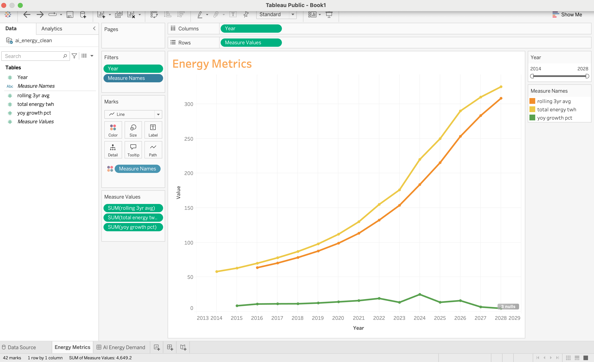
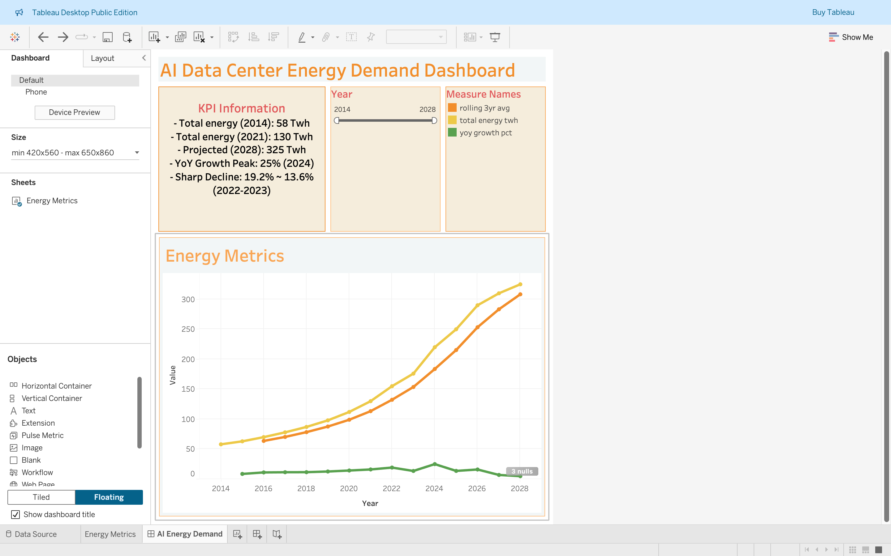

# AI Data Center Energy Demand ETL Project

This project analyzes electricity consumption trends driven by the rapid growth of artificial intelligence (AI) data centers.  
Using an ETL pipeline built with Docker and Python, the data is extracted from publicly available sources, transformed into a clean analytical format, and visualized using Tableau.

The goal is to understand how AI is influencing energy infrastructure over time, and to provide a scalable, reproducible foundation for analyzing similar trends across other domains.

---

## Tech Stack

- Python (data cleaning, transformation)
- Docker (reproducible development environment)
- Google Cloud BigQuery (data warehouse destination)
- Tableau Public (interactive dashboard)
- Git & GitHub (version control and publishing)
- Bash

---

## Project Structure

ai_dc_energy_demand/
├── extract/               # Data ingestion scripts
├── transform/             # Cleaning and wrangling logic
├── load/                  # Load steps into BigQuery
├── data/                  # Raw and processed datasets
├── screenshots/           # Tableau dashboard images
├── Dockerfile             # Container configuration
├── requirements.txt       # Python dependencies
└── README.md              # Project documentation

---

## Tableau Dashboard

[Click here to view the interactive dashboard on Tableau Public](https://public.tableau.com/views/AIDataCenterEnergyDemandDashboard/AIEnergyDemand)
This Tableau dashboard visualizes key trends in AI data center electricity consumption, featuring metrics such as:

- Total energy demand (TWh)
- Year-over-year (YoY) growth rates
- 3-year rolling averages
- Interactive year filters and measure toggles

### Key Insights

- 2014 Energy Demand: 58 TWh  
- 2021 Energy Demand: 130 TWh  
- 2028 Projected Demand: 325 TWh  
- YoY Growth Peak: 25% in 2024  
- Notable Decline: 19.2% to 13.6% between 2022 and 2023

### Preview Images

#### Dashboard Overview  

#### KPI Detail  

---

## How to Run the Project

To run this ETL pipeline using Docker:

### 1. Clone the repository

bash
git clone https://github.com/pucci800/ai_dc_energy_demand.git
cd ai_dc_energy_demand

Build the Container

docker run -t ai_dc_energy_demand .

Run the Container

docker run -it ai_dc_energy_demand

Data Sources
	•	Lawrence Berkeley National Laboratory
	•	Public datasets on electricity usage and AI infrastructure

⸻

License

This project is licensed under the MIT License.

⸻

Author

Peter Puoch
GitHub: pucci800
Tableau Public: AI Data Center Energy Demand Dashboard---

